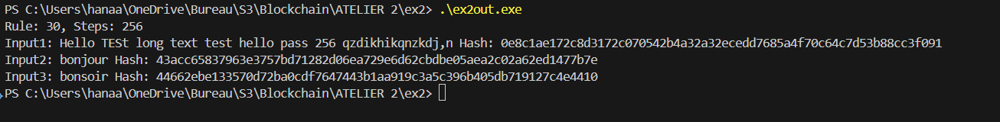
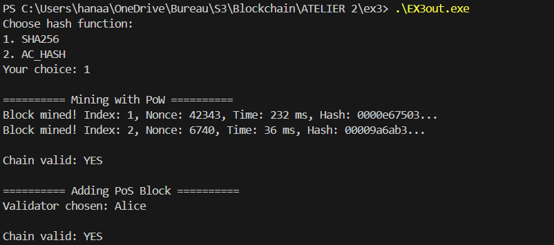
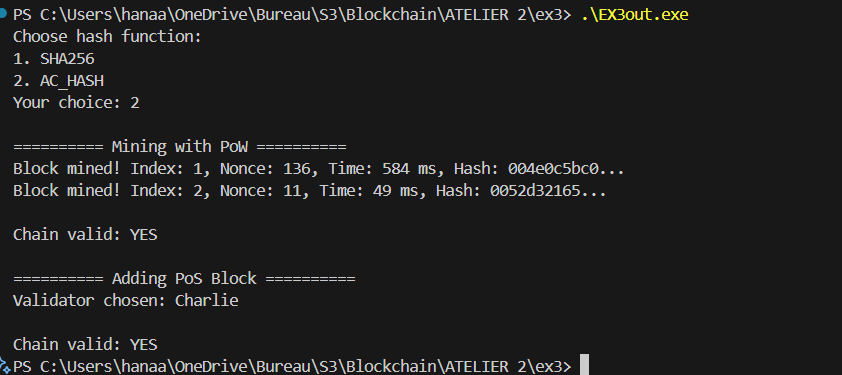
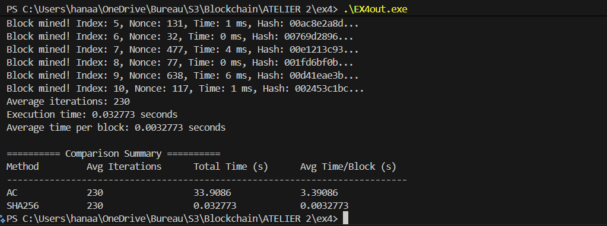
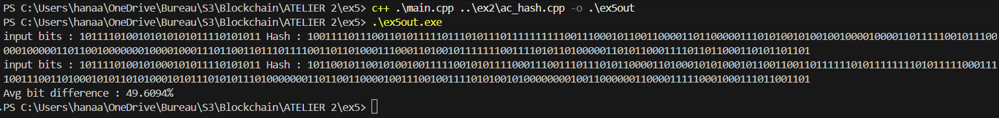
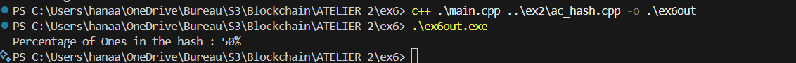
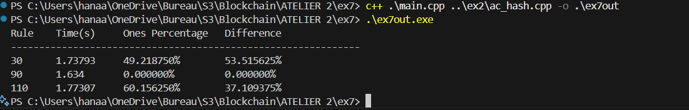

# EXERCICE 2
## Décris le mode de conversion du texte d’entrée en bits

Le texte d’entrée est converti en une représentation binaire à l’aide de la fonction `text_to_bits()`. Chaque caractère du texte est traité comme un octet de 8 bits. Pour chaque caractère :

On parcourt les 8 bits du caractère, du bit le plus significatif (MSB) au bit le moins significatif (LSB).

On ajoute '1' ou '0' à une chaîne de caractères selon que le bit vaut 1 ou 0.

Ensuite, cette chaîne de '0' et '1' peut être convertie en un vecteur d’entiers (0 ou 1) via la fonction `init_state()`, qui initialise l’état du système cellulaire pour le calcul du hash.

__En résumé :__
```
chaque caractère → 8 bits → vecteur binaire pour l’automate cellulaire.
```

##  Explique le processus utilisé pour produire un hash final fixe de 256 bits
Le calcul du hash se fait dans la fonction ac_hash(). Le processus est le suivant :

### Découpage en blocs (chunks) :

La chaîne de bits issue du texte est divisée en blocs de taille fixe `CHUNK_SIZE` (ici 256 bits par exemple).

Si le dernier bloc est incomplet, il est rempli avec des zéros pour atteindre la taille exacte.

### Initialisation de l’état :

Chaque bloc est converti en vecteur d’entiers 0/1 via `init_state()`.

### Évolution de l’automate cellulaire :

L’état du bloc évolue pendant un nombre fixe d’itérations (steps).

À chaque itération, la fonction `evolve()` applique la règle du `CA` (rule number) à chaque cellule selon ses voisins gauche, centre, droite (voisinage de 3).

### Combinaison des blocs :

Après évolution, l’état final de chaque bloc est XORé avec le digest courant (vecteur accumulatif).

Ensuite, le digest lui-même subit une évolution supplémentaire avec la même règle.

### Conversion finale :

Le digest final, un vecteur de taille `CHUNK_SIZE`, est converti en hexadécimal via `bits_to_hex()`.

Le résultat est une empreinte fixe de 256 bits (ou de la taille de digest choisie) représentant le hash du texte d’entrée.

### En résumé :
```
Texte → bits → blocs → CA évolutif → combinaison (XOR) → digest final → hexadécimal.
```

Ce processus assure un hash déterministe, sensible aux modifications d’un seul bit, et de taille fixe.

## Vérifie par un test que deux entrées différentes donnent deux sorties différentes.

l'entree : `bonjour` et `bonsoir` donent des Hash completement different :


# Exercice 3
**Résultat de test :`sha256`**  


**Résultat de test : `AC_HASH`**  



- Le minage fonctionne avec les deux modes de hachage.
- La validation de blocs fonctionne correctement avec `AC_HASH`.


# Exercice 4
**Résultat de test :**  



Le nombre moyen d’itérations est le même pour les deux méthodes (230), ce qui est logique car la difficulté était fixe.

Le temps moyen par bloc est beaucoup plus élevé pour `AC_HASH` (~3.39 s) que pour `sha256` (~0.0033 s), montrant que `AC_HASH` est beaucoup plus lent que `sha256` pour le minage.

`sha256` reste donc plus efficace pour une blockchain classique, mais AC_HASH peut être intéressant pour expérimenter ou tester des fonctions de hachage alternatives.

# Exercice 5
Les résultats montrent qu’en moyenne, environ `50 %` des bits du hash changent lorsqu’un seul bit du message est modifié.

**Résultat de test :**  



# Exercice 6 

Les résultats montrent que le pourcentage moyen de bits à 1  `50 %`, ce qui indique une bonne répartition des bits dans les valeurs de hachage produites par ac_hash

**Résultat de test :**  




# Exercice 7 

**Résultat de test :**  




**Tableau des résultats :**

|  Rule   | Time(s) | Ones percentage | Difference |
| --------- |:--------------:| -------------- |:------------------:|
|30         |1.73793             |49.21%         |53.51%             |
|90     |1.634             |0.00%       |0.00%          |
|110     |1.77307             |60.15%        |37.10%          |


La règle 30 est la meilleure fonction de hachage, car elle produit des résultats équilibrés et une grande différence entre deux entrées ne différant que d’un seul bit.\
La règle 90, en revanche, n’est pas adaptée au hachage, car après quelques itérations, tous les bits deviennent nuls.


